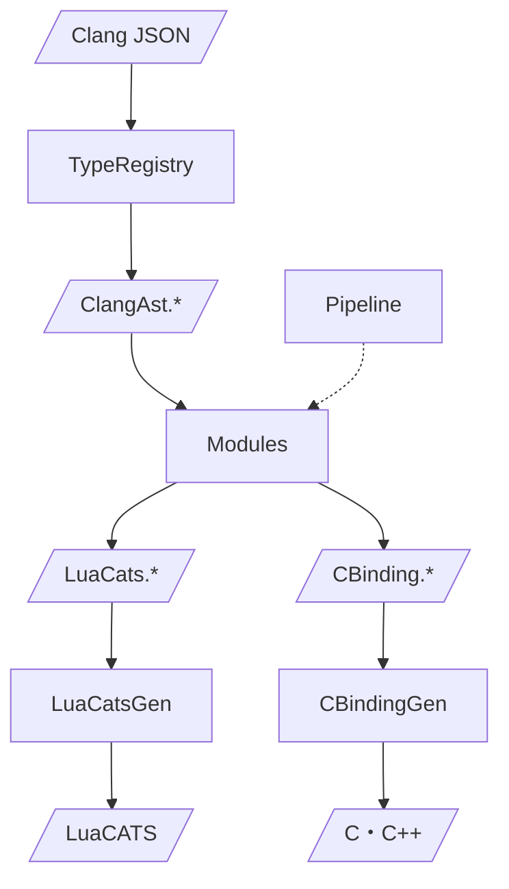

# Generator 設計

C/C++ ライブラリから Lua バインディング（C/C++）と型定義（LuaCATS）を生成するツール。

## アーキテクチャ

Clang JSON を入力として、LuaCATS 型定義と C バインディングを出力する。
入力(ClangAst)と出力(LuaCats/CBinding)それぞれにモデルを持ち、Pipeline がデフォルト変換を提供する。
Modules で変換をカスタマイズし、モジュール固有のコード生成を行う。



| 層 | 入力 | 出力 |
|----|------|------|
| ClangAst.TypeRegistry | Clang JSON | ClangAst.* |
| Modules/* | ClangAst.* | LuaCats.* / CBinding.* |
| LuaCats.Gen | LuaCats.* | 文字列 |
| CBinding.Gen | CBinding.* | 文字列 |
| Pipeline | ClangAst.* | LuaCats.* / CBinding.*（デフォルト変換） |

## 型定義

### ClangAst（入力）

```csharp
namespace Generator.ClangAst;

public abstract record Types { ... }  // Int, Float, Ptr, FuncPtr, StructRef, ...
public record Structs(...);
public record Funcs(...);
public record Enums(...);
```

### LuaCats（出力モデル）

```csharp
namespace Generator.LuaCats;

public abstract record Type
{
    public record Primitive(string Name) : Type;  // integer, number, boolean, string, ...
    public record Fun(List<(string Name, Type Type)> Args, Type? Ret) : Type;
    public record Class(string FullName) : Type;  // app.Desc
}
```

### CBinding（出力モデル）

```csharp
namespace Generator.CBinding;

public abstract record Type { ... }  // Int, Float, Pointer, FuncPtr, Struct, ...
public record FieldInit(string FieldName, string LuaFieldName, Type Type, string? InitCode);
public record Param(string Name, Type Type, string? CheckCode);
```

## ファイル構成

```
Generator/
├── ClangAst.cs        # Clang 入力（Types, Structs, Funcs, Enums, TypeRegistry, CTypeParser）
├── LuaCats.cs         # LuaCATS 出力モデル
├── LuaCatsGen.cs      # LuaCATS 文字列生成
├── CBinding.cs        # C バインディング出力モデル
├── CBindingGen.cs     # C バインディング文字列生成
├── Pipeline.cs        # ClangAst → LuaCats/CBinding 変換
├── Program.cs         # CLI
└── Modules/
    └── App.cs         # sokol_app 固有ロジック
```

## 使用方法

```bash
dotnet run --project Generator -- <input.json> <output-dir>
```

## テスト

```bash
dotnet test
```
