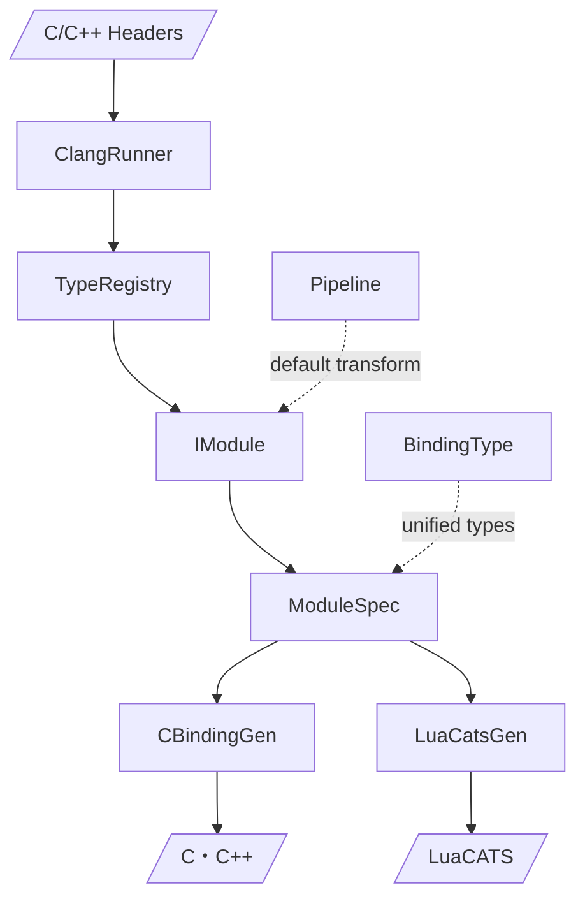

# Generator 設計

C/C++ ヘッダから Lua バインディング（C/C++）と型定義（LuaCATS）を自動生成する。

## アーキテクチャ



| 層 | 責務 |
|----|------|
| `ClangAst/ClangAst.cs` | Clang JSON → `Types`, `Structs`, `Funcs`, `Enums` レコード |
| `ClangAst/TypeRegistry.cs` | `Module` → struct/func/enum 辞書。`CTypeParser` で C 型文字列をパース |
| `ClangAst/SourceLink.cs` | GitHub ソースリンク URL 生成 |
| `BindingType.cs` | 統一型システム（`Int`, `Str`, `Struct`, `Callback`, `Vec2`, `Custom`, ...） |
| `ModuleSpec.cs` | 中間データモデル（`StructBinding`, `FuncBinding`, `EnumBinding`, `OpaqueTypeBinding`） |
| `Pipeline.cs` | ClangAst → `ModuleSpec` デフォルト変換 + 文字列ヘルパ（`ToPascalCase`, `StripPrefix`, ...） |
| `IModule.cs` | `GenerateC(reg, prefixToModule)` / `GenerateLua(reg, prefixToModule, sourceLink?)` |
| `CBinding/CBindingGen.cs` | `ModuleSpec` → C/C++ 文字列生成。`IsCpp` で C++ モード分岐 |
| `LuaCats/LuaCatsGen.cs` | `ModuleSpec` → LuaCATS 文字列生成 |

## モジュール

### Sokol (10 modules) — `Modules/Sokol/`

`SokolModule` 基底クラスが `TypeRegistry` → `ModuleSpec` 変換を自動化。サブクラスはフックのみオーバーライド。

| Class | Prefix | Lua module |
|---|---|---|
| `App` | `sapp_` | `sokol.app` |
| `Audio` | `saudio_` | `sokol.audio` |
| `DebugText` | `sdtx_` | `sokol.debugtext` |
| `Gfx` | `sg_` | `sokol.gfx` |
| `Gl` | `sgl_` | `sokol.gl` |
| `Glue` | `sglue_` | `sokol.glue` |
| `Imgui` | `simgui_` | `sokol.imgui` |
| `Log` | `slog_` | `sokol.log` |
| `Shape` | `sshape_` | `sokol.shape` |
| `Time` | `stm_` | `sokol.time` |

### Dear ImGui — `Modules/Imgui/ImguiModule.cs`

`IModule` 直接実装。clang++ (`-std=c++17`) で `ImGui::` 名前空間をパース。

- `ImVec2`/`ImVec4` → `BindingType.Vec2`/`Vec4`（Lua テーブル）
- オーバーロード → 型サフィックス（`_Str`, `_Int`, `_Float`, ...）
- `CppFuncName` で `ImGui::Func` ディスパッチ
- 出力: `imgui_gen.cpp` + `imgui.lua`

### Miniaudio — `Modules/Miniaudio/MiniaudioModule.cs`

`IModule` 直接実装。`OpaqueTypeBinding` でポインタ型を管理。

## ファイル構成

```
Generator/
  Program.cs              CLI (System.CommandLine)
  IModule.cs              モジュールインターフェース
  ModuleSpec.cs           中間データモデル
  BindingType.cs          統一型システム
  Pipeline.cs             デフォルト変換 + 文字列ヘルパ
  ClangAst/
    ClangAst.cs           Clang JSON パーサ + ClangRunner
    TypeRegistry.cs       型レジストリ
    SourceLink.cs         GitHub リンク生成
  CBinding/
    CBinding.cs           C 出力モデル (Type, FieldInit, Param)
    CBindingGen.cs        C/C++ コード生成
  LuaCats/
    LuaCats.cs            LuaCATS 出力モデル (Type.Primitive, Type.Fun, Type.Class)
    LuaCatsGen.cs         LuaCATS コード生成
  Modules/
    Sokol/
      SokolModule.cs      Sokol 基底クラス
      App.cs ... Time.cs  各モジュール (10)
    Imgui/
      ImguiModule.cs      Dear ImGui (C++)
    Miniaudio/
      MiniaudioModule.cs  Miniaudio
```

## 使用方法

```bash
# CMake 経由（通常はこちら）
scripts\build.bat

# 直接実行
dotnet run --project Generator -- <output-dir> --deps <deps-dir> --clang <clang-path>
```

## テスト

```bash
dotnet test Generator.Tests   # 338 tests
```

テストは JSON フィクスチャベース。clang 不要。`Assert.Contains` で出力順序に依存しない。

## 新モジュール追加

### Sokol モジュール

1. `Modules/Sokol/` に新クラス作成、`SokolModule` 継承
2. `ModuleName` と `Prefix` をオーバーライド
3. 必要に応じてフック（`CustomizeType`, `ExtraRegs` 等）をオーバーライド
4. `Program.cs` の `modules` 配列に追加、`sokolHeaders` にヘッダ追加

### C++ モジュール

1. `IModule` を直接実装
2. `ClangRunner.ParseCppHeadersWithRawJson()` で C++ AST パース
3. `ModuleSpec` を手動構築、`IsCpp = true`
4. `Program.cs` に独立セクション追加
