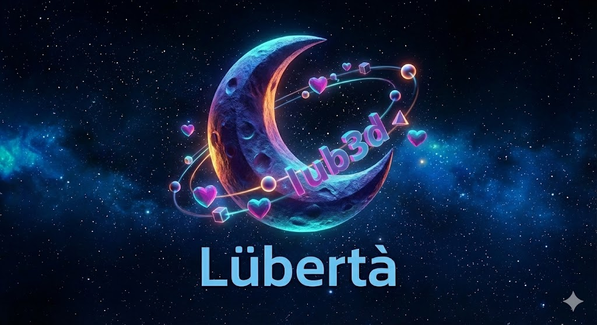
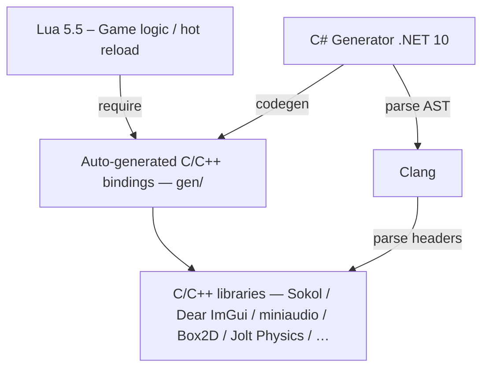

# Lübertà3d / lub3d



A game engine / framework for free and comfortable game programming, built on Lua 5.5 and C/C++ libraries.

## Architecture



The C# Generator parses C/C++ headers via Clang AST, then emits both C binding code and Lua type annotations and documentation. Lua scripts call these bindings directly.

## What Works Now

Thin Lua bindings over Sokol libraries with runtime shader compilation and hot reload.

```lua
local gfx = require("sokol.gfx")

local M = {}
M.width = 800
M.height = 600
M.window_title = "Triangle"

function M:init()
    self.shader = util.compile_shader(shader_source, "triangle")
    self.pipeline = gfx.make_pipeline(gfx.PipelineDesc({ ... }))
end

function M:frame()
    gfx.begin_pass(...)
    gfx.apply_pipeline(self.pipeline)
    gfx.draw(0, 3, 1)
    gfx.end_pass()
    gfx.commit()
end

return M
```

### Available Modules

| Module      | Description                                                   |
| ----------- | ------------------------------------------------------------- |
| `sokol.*`   | gfx, app, gl, debugtext, time, log, glue, audio, shape, imgui |
| `imgui`     | Dear ImGui API                                                |
| `shdc`      | Runtime shader compilation                                    |
| `miniaudio` | Audio engine                                                  |
| `lub3d.fs`  | File system abstraction (Native + WASM)                       |
| `stb.image` | Image loading                                                 |
| `bc7enc`    | BC7 texture encoder                                           |

### Supported Backends

- D3D11 (Windows)
- Metal (macOS)
- OpenGL (Linux)
- WebGPU (WASM)

## Build

```bash
# Windows (D3D11)
cmake --preset win-d3d11-debug
cmake --build --preset win-d3d11-debug

# macOS (Metal)
cmake --preset macos-metal-release
cmake --build --preset macos-metal-release

# Linux (OpenGL)
cmake --preset linux-gl-debug
cmake --build --preset linux-gl-debug
```

Run the example:

```bash
./build/win-d3d11-debug/examples/lub3d-example.exe examples.hello
./build/win-d3d11-debug/examples/lub3d-example.exe examples.triangle
```

See [docs/building.md](docs/building.md) for more options.

## Ideas

Not yet implemented.

### Retained Mode + Auto GC

Pass all resources every frame. Same handle = reuse. Unused handles get garbage collected.

```lua
function frame()
    draw_mesh({
        shader = my_shader_handle,
        mesh = my_mesh_handle,
        transform = transform,
    })
end
```

### Blender as Editor

- Object name = script name (`elevator_01` → `elevator_01.lua`)
- Custom properties for parameters
- glTF export

### Other Ideas

- Fennel + sequence macros

## Design Principles

- **À la carte** - No monolithic framework. Compose from standalone modules.
- **Lua for gameplay, C for performance** - Write game logic fast, optimize hot paths in C.
- **Asset freedom** - No proprietary formats. Generate and modify anything from Lua at runtime.
- **As fast as you type** - Hot reload code, shaders, assets. The tools never slow you down.

## Generative AI Usage Disclosure

- **Source code and documentation**: Developed with Claude Code
- **Logo image**: Generated using Nano Banana (Gemini image generation)

All AI-generated outputs are reviewed and modified before inclusion.

## License

MIT
