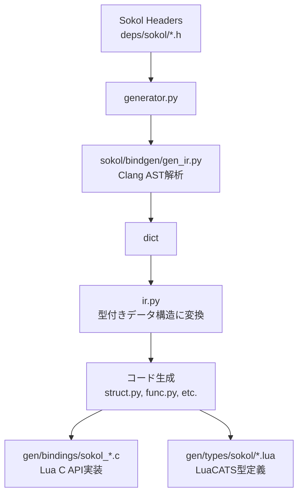

# Binding Generation

Sokol C ヘッダーから Lua バインディングを自動生成するパイプライン。

## 処理の流れ



## コンポーネント

### 1. sokol bindgen (deps/sokol/bindgen/gen_ir.py)

Clang を使って C ヘッダーを解析し、dict を返す。

| 入力 | 出力 |
| ---- | ---- |
| `sokol_gfx.h` 等 | Python dict (メモリ上) |

**抽出対象:**
- struct (名前、フィールド、型)
- enum (定数値)
- func (関数シグネチャ、引数、戻り値)

### 2. binding_gen framework (scripts/binding_gen/)

IRを読み込み、CバインディングとLua型定義を生成。

| ファイル | 役割 |
| -------- | ---- |
| `generator.py` | 全体オーケストレーション、gen_ir.py 呼び出し |
| `ir.py` | IR データ構造定義、dict → 型付きオブジェクト変換 |
| `types.py` | Lua ↔ C 型変換コード生成 |
| `struct.py` | struct コンストラクタ・アクセサ生成 |
| `func.py` | 関数ラッパー生成 |
| `enum.py` | enum 登録コード生成 |
| `callback.py` | コールバックトランポリン生成 |
| `luacats.py` | LuaCATS 型定義生成 |

### 3. Sokol 固有設定 (scripts/bindings/sokol.py)

モジュール構成とカスタムハンドラを定義。

| プレフィックス | モジュール名 |
| -------------- | ------------ |
| `sg_` | gfx |
| `sapp_` | app |
| `saudio_` | audio |
| `slog_` | log |
| `stm_` | time |
| `sgl_` | gl |
| `sdtx_` | debugtext |
| `sshape_` | shape |

**カスタムハンドラ例:**
- `sg_range`: 文字列からの初期化をサポート
- `sapp_desc`: ホットリロード対応コールバック

## 実行方法

```bash
python scripts/gen_lua.py
```

## 生成ファイル

| パス | 内容 |
| ---- | ---- |
| `gen/stubs/*.json` | Clang解析結果 (デバッグ用) |
| `gen/bindings/sokol_*.c` | Lua C API バインディング |
| `gen/types/sokol/*.lua` | IDE向け型定義 |

## 型変換

### Lua → C

```c
// integer
uint32_t id = (uint32_t)luaL_checkinteger(L, 1);

// string
const char* str = luaL_checkstring(L, 1);

// struct (userdata)
sg_buffer* buf = (sg_buffer*)luaL_checkudata(L, 1, "sokol.Buffer");
```

### C → Lua

```c
// integer
lua_pushinteger(L, (lua_Integer)result);

// struct (新規userdata)
sg_buffer* ud = lua_newuserdatauv(L, sizeof(sg_buffer), 0);
*ud = result;
luaL_setmetatable(L, "sokol.Buffer");
```

## 拡張ポイント

| 拡張方法 | 用途 |
| -------- | ---- |
| `TypeHandler` 実装 | カスタム型変換 |
| `struct_handlers` 登録 | コールバック設定、フィールドスキップ |
| `global_ignores` 追加 | 特定関数の除外 |
